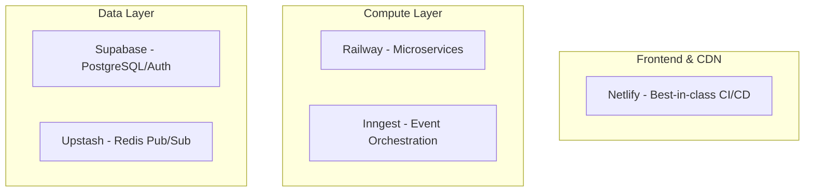

# NiceStory.app Technical Showcase

**Interactive Story Worlds | Branching Narratives | Persistent Story Memory**

[](https://nicestory.app)
[]()
[]()

Not just another AI story generator - a platform that creates persistent, interactive story worlds:
- **User Choice System**: Every decision creates a unique story branch that remembers your path
- **Story World Templates**: Not generic AI stories - each template defines characters, rules, and narrative DNA
- **Narrative Red Thread**: 90% of engineering went into maintaining story coherence across branches
- **Universal Story Memory**: Characters and plot elements persist across all chapters and choices

## 🎯 What Makes This Different

### Not Just "Generate a Story with AI"

Every AI tool can generate a story. NiceStory.app creates **persistent story worlds** where:

1. **Your Choices Matter**: Each decision branches the narrative permanently
2. **The World Remembers**: Characters you meet, places you visit, items you find - all persist
3. **Templates Are Worlds**: Not prompts, but complete narrative frameworks with rules, physics, and logic
4. **The Red Thread**: Complex orchestration ensures narrative coherence across all branches

### The Engineering Challenge

The real complexity wasn't connecting to OpenAI - it was:
- **Branch Management**: How do you handle exponential story paths?
- **Context Windows**: AI has limits, but stories need infinite memory
- **Narrative Coherence**: How do you prevent contradictions across branches?
- **User Agency**: Real choices, not illusions of choice

## 🚀 Core Innovations

### Performance Improvements
- **Entity Extraction**: ~5% pattern-matching → 95% AI semantic understanding
- **Cost Optimization**: €50-60/month Edge Functions → €10-15/month Railway services  
- **SEO Efficiency**: 100+ daily refreshes → ~10 relevant ones (95% reduction)
- **Query Performance**: 99% faster gallery queries via materialized views

### System Evolution
- **Edge Functions Era**: 17 functions, 60s timeout limits, constant failures
- **Railway Migration**: 7 specialized microservices, unlimited processing time
- **Event Architecture**: Inngest orchestration for fault-tolerant workflows

## 🏗️ Architecture Overview

### Why 5 Cloud Providers?

Each provider was chosen for specific strengths:



### Microservices Architecture

```
┌─────────────────────────────────────────────────┐
│                   Frontend                      │
│         React 18.3 + TypeScript + Vite          │
└────────────────────┬────────────────────────────┘
                     │
        ┌────────────┴────────────┐
        │                         │
┌───────▼────────┐       ┌───────▼────────┐
│ Content Service│       │ Model Service  │
│   (Railway)    │       │   (Railway)    │
└────────────────┘       └────────────────┘
        │                         │
        └────────────┬────────────┘
                     │
            ┌────────▼────────┐
            │   Supabase DB   │
            │  (PostgreSQL)   │
            └─────────────────┘
```

## 💡 Technical Innovations

### 1. Story Evolution System
Universal AI entity extraction from story text in ANY language:
- **Languages**: German, Chinese, Arabic, Japanese, English, French, and ALL others
- **Accuracy**: >95% (vs previous ~5% pattern-matching)
- **Impact**: 19x improvement in narrative continuity

### 2. SEO Event System v2.1.0
Complete automation eliminating manual intervention:
- **Database Triggers**: Automatic detection of SEO-relevant changes
- **PostgreSQL pg_notify**: Real-time listener for instant updates
- **Smart Debouncing**: Max 1 refresh/minute prevents overload
- **Result**: 95% reduction in unnecessary database operations

### 3. SmartButton UX Pattern
Eliminated toast notification complexity across the platform:
```typescript
// Before: Complex toast management
const handleAction = async () => {
  toast.loading('Processing...');
  try {
    await action();
    toast.success('Done!');
  } catch {
    toast.error('Failed');
  }
};

// After: SmartButton pattern
const buttonState = useSmartButton();
const handleAction = async () => {
  buttonState.setLoading();
  try {
    await action();
    buttonState.setSuccess('Done!');
  } catch {
    buttonState.setError('Failed');
  }
};
```

### 4. Provider Factory Pattern
Abstraction layer managing AI provider chaos:
- Unified interface for text, image, and audio generation
- Automatic failover between providers
- Cost optimization through intelligent routing
- Quality scoring for provider selection

## 📊 Real Production Metrics

### Scale
- **Public Stories**: 33 curated stories in production
- **Processing Time**: Unlimited (vs 60s Edge Function limits)
- **Microservices**: 7 specialized Railway services
- **Languages**: Universal support (not just major languages)

### Cost Optimization Journey
```
Edge Functions Era:  €50-60/month
  ↓ Railway Migration
Current:            €10-15/month
Savings:            75% reduction
```

## 🛠️ Tech Stack & Architecture

### The "Nebenprodukte" (Side Products)
Projects that started as utilities but became essential infrastructure:

#### [AI Provider Factory](https://github.com/patrickmauro/ai-provider-factory)
- **What it is**: Database-driven AI orchestration system
- **Why it exists**: Managing 5+ AI providers was chaos
- **Impact**: 68% cost reduction, 99.9% reliability
- **Scale**: 15,000+ requests/day across 44 models

### Frontend
- **React 18.3** with TypeScript 5.3
- **Vite 5.4** for blazing fast builds
- **TailwindCSS** + **shadcn/ui** components
- **TanStack Query** for server state
- **i18next** for internationalization

### Backend Services
- **Railway**: Microservices hosting (7 specialized services)
- **Inngest**: Event-driven orchestration
- **Supabase**: PostgreSQL + Auth + Storage
- **Upstash Redis**: Pub/Sub for SSE
- **AI Providers**: Unified through AI Provider Factory

## 📁 Repository Structure

```
docs/
├── architecture/           # System design decisions
├── innovations/           # Technical breakthroughs
└── code-samples/         # Sanitized production code

diagrams/                 # Architecture visualizations
metrics/                  # Performance measurements
assets/                   # Screenshots and diagrams
```

## 🔍 Deep Dives

### Core Innovations
- [Story Template System](./docs/innovations/story-template-system.md) - **The actual innovation** - persistent story worlds, not just AI text
- [Story Evolution System](./docs/innovations/story-evolution-system.md) - Universal entity extraction maintaining the "red thread"
- [User Choice System](./docs/innovations/story-template-system.md#user-choice-system) - Real branching narratives with permanent consequences

### Technical Architecture  
- [AI Provider Factory](./docs/architecture/ai-provider-factory.md) - **The "Nebenprodukt"** - Database-driven AI orchestration system
- [Microservices Evolution](./docs/architecture/microservices-evolution.md) - From Edge Functions to Railway
- [SmartButton Pattern](./docs/code-samples/smart-button/README.md) - UX pattern eliminating toast chaos

## 💭 Lessons Learned

### Technical Insights
1. **Provider Lock-in is Real**: Using best-in-class providers for each job pays off
2. **Event-Driven > Synchronous**: Especially for AI workloads
3. **Caching Strategy Matters**: 40-60% cost reduction through intelligent caching
4. **Migration Patterns Work**: Zero-downtime migrations are achievable

### Architectural Decisions
- **Microservices**: Worth the complexity for scalability
- **Multiple Providers**: Resilience over simplicity
- **Event Orchestration**: Essential for long-running AI tasks
- **Type Safety**: TypeScript everywhere prevents runtime errors

## 🔗 Portfolio & Contact

Learn more about my work and other projects:
- **Portfolio**: [aeberhard.ai](https://aeberhard.ai)
- **LinkedIn**: [Patric Aeberhard](https://www.linkedin.com/in/patricaeberhard/)
- **Email**: patric@aeberhard.ai

---

*This showcase demonstrates the technical architecture and innovations behind NiceStory.app without exposing proprietary code or business secrets.*