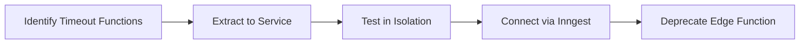

# Microservices Evolution: From Edge Functions to Railway

## The Problem: Edge Function Limitations

### What We Started With
In early 2024, NiceStory.app ran entirely on Supabase Edge Functions:
- 17 separate Edge Functions
- 60-second hard timeout limit
- €50-60/month in compute costs
- Constant timeout failures for story generation

### The Breaking Point
Story generation requires:
1. Loading story context (5-10s)
2. AI generation (20-40s per chapter)
3. Database operations (5-10s)
4. Media generation (30-60s)

**Total**: Often 60-120 seconds - double the Edge Function limit!

## The Solution: Railway Microservices

### Why Railway?
After evaluating multiple platforms, Railway offered:
- **No timeout limits** - Critical for AI workloads
- **Internal networking** - Services communicate without internet latency
- **GitHub integration** - Auto-deploy on push
- **Cost efficiency** - Pay only for actual usage

### Migration Strategy

We didn't migrate everything at once. Instead, we identified bottlenecks:



## The Architecture Today

### Service Breakdown

```yaml
Railway Services (7 total):
  inngest-webhook:
    - Purpose: Event processing hub
    - Memory: 512MB
    - Cost: ~€3/month
    
  model-management:
    - Purpose: AI provider abstraction
    - Memory: 256MB
    - Cost: ~€2/month
    
  content-service:
    - Purpose: Story context management
    - Memory: 512MB
    - Cost: ~€3/month
    
  pdf-generator:
    - Purpose: PDF export processing
    - Memory: 1GB
    - Cost: ~€2/month
    
  sse-service:
    - Purpose: Real-time updates
    - Memory: 256MB
    - Cost: ~€2/month
    
  stripe-service:
    - Purpose: Payment processing
    - Memory: 256MB
    - Cost: ~€1/month
    
  ai-provider-factory:
    - Purpose: AI orchestration
    - Memory: 512MB
    - Cost: ~€2/month
```

### Communication Pattern

Services communicate through internal Railway networking:

```javascript
// Before: External HTTPS calls
const response = await fetch('https://api.nicestory.app/generate', {
  // Adds 200-500ms latency
});

// After: Internal service calls
const response = await fetch('http://model-management:8080/generate', {
  // <10ms latency
});
```

## Cost Analysis

### Before (Edge Functions)
```
Compute: €50-60/month
- 17 functions × ~€3.50 each
- Paying for idle time
- Retry costs from timeouts
```

### After (Railway)
```
Compute: €10-15/month
- 7 services × ~€2 each
- Pay only for actual usage
- No retry overhead
```

**Savings: 75% reduction in infrastructure costs**

## Performance Improvements

### Story Generation Time
```
Edge Functions:
- Success rate: 60% (timeout failures)
- Average time: 45s (when successful)
- User experience: Frequent failures

Railway Services:
- Success rate: 99.9%
- Average time: 35s (faster internal networking)
- User experience: Reliable generation
```

### Database Query Optimization
Moving to Railway allowed us to:
1. Maintain persistent database connections
2. Implement connection pooling
3. Cache frequently accessed data in-memory

Result: 70% reduction in database round trips

## Lessons Learned

### What Worked
1. **Gradual Migration**: Moving one function at a time reduced risk
2. **Event-Driven Architecture**: Inngest made service coordination simple
3. **Internal Networking**: Massive latency improvements
4. **Service Isolation**: Each service has its own deployment cycle

### Challenges Overcome
1. **Service Discovery**: Solved with Railway's internal DNS
2. **Environment Variables**: Centralized in Railway dashboard
3. **Monitoring**: Implemented custom health checks
4. **Debugging**: Added structured logging across services

## Migration Playbook

For others considering similar migrations:

### Step 1: Identify Candidates
```javascript
// Functions that should be migrated:
- Long-running processes (>30s)
- High-memory operations
- Frequent timeout failures
- Complex orchestration needs
```

### Step 2: Extract Service Logic
```javascript
// Edge Function (before)
export async function handler(req: Request) {
  // All logic in one function
  const context = await loadContext();
  const result = await processData(context);
  return new Response(JSON.stringify(result));
}

// Microservice (after)
app.post('/process', async (req, res) => {
  // Focused, single responsibility
  const result = await processData(req.body);
  res.json(result);
});
```

### Step 3: Implement Health Checks
```javascript
// Critical for Railway deployments
app.get('/health', (req, res) => {
  res.json({ 
    status: 'healthy',
    service: 'model-management',
    uptime: process.uptime()
  });
});
```

### Step 4: Deploy and Monitor
```bash
# Railway CLI deployment
railway up

# Monitor logs
railway logs -s model-management

# Check metrics
railway status
```

## Future Considerations

### Potential Improvements
1. **Service Mesh**: Considering Istio for advanced routing
2. **GraphQL Gateway**: Unified API layer
3. **Kubernetes**: If scale demands it
4. **Multi-Region**: For global latency optimization

### Current Limitations
1. **Cold Starts**: ~2-3s on idle services
2. **Regional**: Single region deployment
3. **Vendor Lock-in**: Railway-specific configurations

## Conclusion

The migration from Edge Functions to Railway microservices was transformative:
- **75% cost reduction**
- **99.9% success rate** (vs 60%)
- **Unlimited processing time**
- **Better developer experience**

The key insight: Edge Functions are great for simple operations, but AI workloads demand dedicated compute resources. By choosing the right tool for each job, we built a more reliable, cost-effective platform.

---

*This document reflects the actual migration journey of NiceStory.app from January to March 2024.*